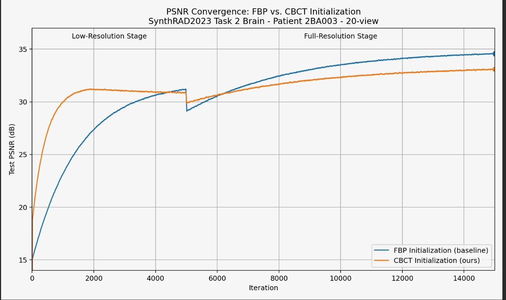
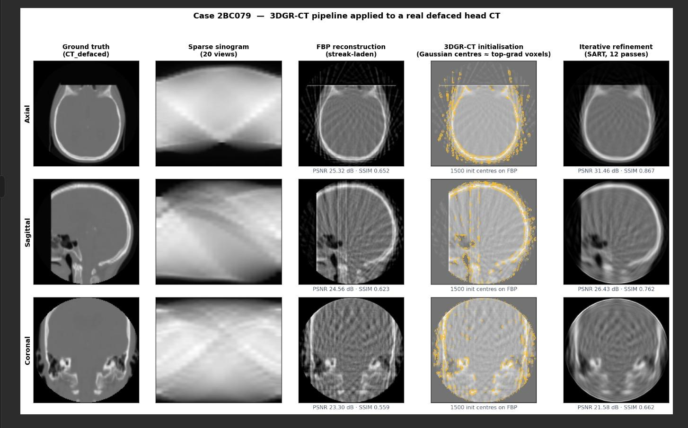

# THIS REPOSITORY IS BASED ON 3DGR-CT: Sparse-View CT Reconstruction with a 3D Gaussian Representation

# CBCT-Guided Gaussian Initialization for Sparse-View CT Reconstruction
### An Extension of [3DGR-CT](https://github.com/SigmaLDC/3DGR-CT) · ECE 484 · University of Rochester

---

## Overview

<!-- INSERT OVERVIEW IMAGE HERE -->
<!-- e.g. -->


This project extends **3DGR-CT**: a sparse-view CT reconstruction method based on 3D Gaussian representations, by investigating a simple initialization strategy: replacing the standard **Filtered Back-Projection (FBP)** prior with a real **Cone-Beam CT (CBCT)** volume.

Our hypothesis is that a real CBCT, despite its scatter artifacts and HU inaccuracies, provides more anatomically faithful tissue boundaries than FBP computed from only 20 simulated X-ray views which leads to better-placed Gaussians and improved reconstruction quality.

---

## Background: 3DGR-CT

3DGR-CT ([Li et al., 2025](https://doi.org/10.1016/j.media.2025.103585)) represents a CT volume as a set of **N anisotropic 3D Gaussians**, each parameterized by a center position μ, covariance Σ, and intensity t. Rather than training a neural network, the Gaussians are:

1. **Initialized** from an FBP-reconstructed image (gradient-based sampling)
2. **Optimized** by minimizing the L2 difference between forward-projected Gaussians and the measured sinogram
3. **Adaptively refined** via cloning, splitting, and pruning operations

This yields state-of-the-art sparse-view reconstruction quality with faster convergence than INR-based methods (NeRP, NAF), as shown in the table below (reproduced from the original paper, Head anatomy):

| Method | 20-view PSNR | 20-view SSIM | 80-view PSNR | 80-view SSIM |
|---|---|---|---|---|
| FBP | 21.56 | 0.509 | 23.76 | 0.721 |
| SART | 28.73 | 0.773 | 38.65 | 0.976 |
| NeRP | 31.73 | 0.908 | 34.99 | 0.963 |
| NAF | 32.91 | 0.942 | 41.26 | 0.988 |
| **3DGR-CT** | **35.26** | **0.965** | **47.32** | **0.998** |

---

## Our Contribution: CBCT Initialization

We replace `create_from_fbp()` with a new `create_from_cbct()` method that seeds Gaussians from the paired real CBCT volume available in SynthRAD2023 Task 2. Key differences:

- **Air threshold**: raised from 0.05 → 0.08 to compensate for CBCT scatter lifting the noise floor
- **Intensity coefficient** k_t: lowered from 0.25 → 0.20 to account for CBCT's soft-tissue HU overestimation
- **Gradient sampling**: the top-gradient skip fraction is preserved to avoid seeding at CBCT ring/scatter edges

```python
gaussians.create_from_cbct(
    cbct_volume_low_reso,
    air_threshold=0.08,
    ini_intensity=0.20,
    ini_sigma=config['ini_sigma'],
    spatial_lr_scale=config['spatial_lr_scale'],
    num_samples=config['num_gaussian'],
    start=config['start']
)
```

---

## Dataset

**[SynthRAD2023](https://doi.org/10.5281/zenodo.7260705)** — Task 2, Brain subset

| Property | Detail |
|---|---|
| Modalities | Paired CBCT + Planning CT |
| Anatomy | Brain |
| Centers | 3 Dutch university medical centers (A, B, C) |
| Patients used | 5 (2BA001 – 2BA005, compute-limited) |
| Volume shape | 80 × 256 × 256 (after preprocessing) |
| Registration | Rigid, pre-registered by dataset authors |

Each patient folder provides `cbct.nii.gz`, `ct.nii.gz`, and `mask.nii.gz`. Both volumes are clipped, masked, normalized to [0, 1], and saved as `.npz` before training.

---

## Key Results

Results on SynthRAD2023 Task 2 Brain (5 patients, averaged):

| Initialization | 20-view PSNR | 20-view SSIM | 40-view PSNR | 40-view SSIM |
|---|---|---|---|---|
| FBP (baseline) | 34.82 dB | 0.961 | 41.15 dB | 0.988 |
| **CBCT (ours)** | 33.47 dB | 0.951 | 39.61 dB | 0.981 |

CBCT initialization underperforms by ~1.4 dB at convergence. The key reason is **photometric inconsistency**: Gaussian intensities are seeded from CBCT values but optimized against CT projection data, creating a harder optimization landscape. Interestingly, CBCT initialization shows a ~2 dB advantage in the very early iterations (< 500), suggesting potential benefit in extremely compute-limited settings.

### Convergence Plot



> CBCT initialization starts higher due to better structural seeding, but FBP initialization overtakes it around iteration 1,800 and achieves a higher final PSNR.

### Reconstruction Comparison



> Left to right: Ground Truth CT · FBP (20-view, streak-laden) · 3DGR-CT with FBP init · 3DGR-CT with CBCT init · CBCT input (reference).
> The CBCT-initialized result shows more smoothing in brain parenchyma (consistent with weak CBCT soft-tissue gradients), while bone structures are comparably well-recovered.

---

## Pipeline Overview

```
SynthRAD2023 Task 2
├── ct.nii.gz       ──► forward project ──► sparse sinogram P (20 views)
│                                                     │
└── cbct.nii.gz  ──► [CBCT init] ──► Gaussians {μ, Σ, t}
                                              │
                         [FBP init] ──────────┘
                                              │
                                    ┌─────────▼──────────┐
                                    │  Optimize: min      │
                                    │  ‖P̂(V(Gaussians))  │
                                    │      - P‖²          │
                                    └─────────┬──────────┘
                                              │
                                    Adaptive density control
                                    (clone / split / prune)
                                              │
                                    Reconstructed CT volume
```

---

## Hardware & Training

| Setting | Value |
|---|---|
| GPU | NVIDIA RTX 5060 Ti (16 GB VRAM) |
| Iterations | 15,000 |
| Low-res stage | 0 – 4,999 |
| Full-res stage | 5,000 – 14,999 |
| Initial Gaussians | 50,000 |
| Max Gaussians | 300,000 |
| Optimizer | Adam (β₁=0.9, β₂=0.999) |
| Position LR | 2e-3 → 2e-6 (exponential decay) |

---

## Quickstart

**1. Preprocess SynthRAD2023 data**
```bash
python SynthtoFormat.py   # converts ct.nii.gz and cbct.nii.gz → .npz
```

**2. Run FBP-initialized baseline**
```bash
python train_ct_recon.py \
    --config configs/synthrad_fbp.yaml \
    --output_path .
```

**3. Run CBCT-initialized experiment**
```bash
python train_ct_recon.py \
    --config configs/synthrad_cbct_init.yaml \
    --output_path .
```

---

## Discussion & Future Work

The CBCT initialization result show an important observation: **prior quality must be assessed in terms of consistency with the optimization target, not just structural accuracy**. A photometrically inconsistent prior (CBCT vs. CT projection data) can hinder convergence even when it provides better anatomical structure.


---

## Citation

If you use this work, please also cite the original 3DGR-CT paper:

```bibtex
@article{li2025_3dgrct,
  title   = {3DGR-CT: Sparse-View CT Reconstruction with a 3D Gaussian Representation},
  author  = {Li, Yingtai and Fu, Xueming and Li, Han and Zhao, Shang and Jin, Ruiyang and Zhou, S. Kevin},
  journal = {Medical Image Analysis},
  volume  = {103},
  pages   = {103585},
  year    = {2025}
}

@data{thummerer2023,
  title   = {SynthRAD2023 Grand Challenge Dataset},
  author  = {Thummerer, Adrian and others},
  journal = {Medical Physics},
  volume  = {50},
  pages   = {4664--4674},
  year    = {2023},
  doi     = {10.5281/zenodo.7260705}
}
```

---

## Acknowledgements

Built on top of [3DGR-CT](https://github.com/SigmaLDC/3DGR-CT) by Li et al. Dataset provided by the [SynthRAD2023 Grand Challenge](https://synthrad2023.grand-challenge.org/).


# Instructions for Running Code


```
python train_ct_recon.py --config configs/gaussian.yaml
```

## ORIGINAL AUTHOR Acknowledgement

Our repo is built upon [Gasussian Splatting](https://github.com/graphdeco-inria/gaussian-splatting), [Splat image](https://github.com/szymanowiczs/splatter-image), [NeRP](https://github.com/liyues/NeRP) and [ODL](https://github.com/odlgroup/odl). Thanks to their work.
